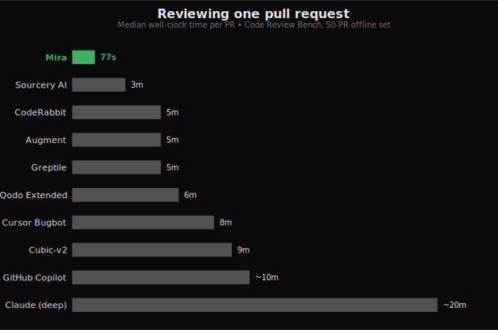
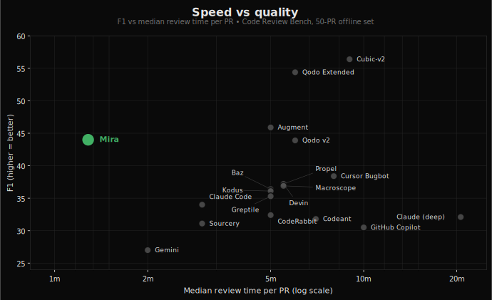

<p align="center">
  
</p>

<h1 align="center">Mira</h1>

<p align="center">
  <strong>Self-hosted AI code review. Your code, your dashboard, your LLM key.</strong>
</p>

<p align="center">
  <a href="https://docs.miracode.ai"></a>
  <a href="https://discord.gg/uEU6qvYhgm"></a>
</p>

Self-host every feature: full review engine, codebase indexing, vulnerability scanning, custom rules, org-wide package search, dashboard, learning loop. No paid tier, no license key, no SaaS upsell.

Mira reviews your pull requests using your choice of LLM (via [OpenRouter](https://openrouter.ai), which fronts Anthropic, OpenAI, Google, DeepSeek, and more) and posts concise, actionable feedback. The noise filter, confidence clamping, and learning loop ensure you only see comments that matter. See [`FEATURES.md`](FEATURES.md) for the full surface.

## Dashboard


## Your data, your dashboard

Most AI reviewers are SaaS: your diffs (and often the full surrounding code) leave for a third-party server, and the only "view" you get is the comments that come back on a PR. Mira flips both halves of that:

- **Your code never leaves your infra.** Diffs, embeddings, indexes, review history, vulnerability data, all stored in your SQLite or Postgres, on infrastructure you own. No phone-home, no required telemetry, no "is this used for training?" question.
- **The dashboard you see above is yours.** It's not a marketing screenshot of someone else's view of your code. CodeRabbit, Greptile, and similar SaaS reviewers don't expose anything like it. Mira's dashboard surfaces signals you don't get anywhere else:
  - **Org-wide package inventory**: answer "which repos use `lodash@4.17.20`?" in one query. Stack it next to your CVE feed for instant blast-radius checks.
  - **CVE alerts on every dependency**: hourly OSV.dev poll, severity + advisory link + fix version surfaced inline next to the package.
  - **Dependency + blast-radius graphs**: see exactly which files and repos depend on a symbol before you change it.
  - **Per-repo review event stream**: every webhook, every chunk, every cost figure, in one place for live troubleshooting.
  - **Cost & token telemetry**: actual spend per repo and per model, not estimates, because you control the LLM key.
  - **Coming soon, change-frequency heatmaps**: surface the files that bug fixes keep landing on so you can target review attention.

If your engineering team needs answers like *"which of our repos are exposed to this CVE?"* or *"what's the blast radius of changing this function?"*, those questions stop being multi-day investigations and start being one-click dashboard pages.

## Highlights

- **Any OpenAI-compatible endpoint**: OpenRouter by default (Anthropic, OpenAI, Google Gemini, DeepSeek, …), or point `llm.base_url` at vLLM, Ollama, LiteLLM proxy, LocalAI, llama.cpp, Together, Fireworks, Groq, or Cerebras for self-hosted / data-resident reviews. See [Custom endpoints](https://docs.miracode.ai/configuration/mira-yml#custom-endpoints).
- **Low noise**: Confidence thresholds, dedupe, severity sorting, per-PR comment caps
- **Indexed reviews**: full-repo code index gives the LLM real context, not just the diff
- **Learns your team**: synthesizes rules from rejected comments and human review patterns on merged PRs
- **Vulnerability scanning**: hourly OSV.dev poll surfaces CVEs across every package in every repo
- **Org-wide package search**: answer "which repos use `lodash@4.17.20`?" in seconds
- **Configurable**: `.mira.yaml` for per-repo settings, custom + global rules in the dashboard
- **Self-host on day one**: Docker image, Railway / Fly.io / Render configs, SQLite or Postgres
- **GitHub today, more platforms coming**: GitLab, Bitbucket, and Gitea support are on the roadmap. Same review engine, same dashboard, just a different provider adapter

## Benchmark

Mira is **the fastest tool measured** on the public [Code Review Bench](https://codereview.withmartian.com/?mode=offline), and the only one on the speed/quality Pareto frontier: every tool that scores higher on F1 takes **5–14× longer per PR**.



Plotted against every published competitor on the same subset, Mira sits in the upper-left corner: everything to the right is slower; everything above it pays 5–14× the wall time for the extra F1.



Measured on the same 25-PR offline subset (5 PRs each from Sentry, Grafana, Keycloak, Discourse, Cal.com), judged by Claude Sonnet 4.5.

| | **Mira** | Cubic-v2 | Greptile | CodeRabbit | GitHub Copilot |
|---|---:|---:|---:|---:|---:|
| F1 | **39** | 56 | 35 | 32 | 31 |
| Precision | **36%** | 50% | 32% | 24% | 24% |
| Recall | **43%** | 65% | 40% | 50% | 43% |
| Median time / PR | **~85s** | ~9m | ~5m | ~5m | ~10m |

> Methodology: scores measured against the [Martian Code Review Bench](https://codereview.withmartian.com/?mode=offline) offline dataset with Claude Sonnet 4.5 as the judge.

## Quick Start

### GitHub App (self-hosted)

Run Mira as a GitHub App that auto-reviews every PR and responds to comments.

> **Note:** GitHub is the only supported provider today. **GitLab, Bitbucket, and Gitea adapters are on the roadmap.** The review engine, indexer, and dashboard are provider-agnostic; only the webhook + comment-posting layer is GitHub-specific. Star the repo to follow along.

**1. Create a GitHub App** at [github.com/settings/apps/new](https://github.com/settings/apps/new):
- Webhook URL: `https://your-server.com/github/webhook`
- Permissions: Pull Requests (read+write), Contents (read), Issues (read+write)
- Events: Pull requests, Issue comments
- Generate a private key (.pem)

**2. Deploy:**

[](https://railway.com/workspace/templates/05874bad-2d98-43f4-aa93-332f394e9ebd)

Or with Docker:

Two files: `mira.yaml` for non-secret defaults, `.env` for secrets. Pass both into the container.

```yaml
# mira.yaml: deployment-wide defaults. Every key is optional.
llm:
  model: "anthropic/claude-sonnet-4-6"
  fallback_model: "anthropic/claude-haiku-4-5"
  indexing_model: "anthropic/claude-haiku-4-5"

filter:
  confidence_threshold: 0.7
  max_comments: 5

review:
  walkthrough: true
  self_critique: true
  security_pass: true
```

```bash
# .env: secrets only. Don't commit this.
MIRA_GITHUB_APP_ID=123456
MIRA_GITHUB_PRIVATE_KEY="$(cat private-key.pem)"
MIRA_WEBHOOK_SECRET=your-secret
OPENROUTER_API_KEY=sk-or-...
```

```bash
docker run -p 8000:8000 \
  --env-file .env \
  -v "$(pwd)/mira.yaml:/app/mira.yaml" \
  ghcr.io/miracodeai/mira:latest \
  --config /app/mira.yaml
```

Mira talks to OpenRouter under the hood, so any model OpenRouter supports works. `llm.model` in `mira.yaml` is whatever the [OpenRouter Models page](https://openrouter.ai/models) lists. Examples:

| Provider | `llm.model` |
|----------|--------------|
| Anthropic | `anthropic/claude-sonnet-4-6` |
| Anthropic (cheap, indexing) | `anthropic/claude-haiku-4-5` |
| OpenAI | `openai/gpt-4o` |
| OpenAI (cheap) | `openai/gpt-4o-mini` |
| Google | `google/gemini-2.5-pro` |

Set `OPENROUTER_API_KEY` once; one key works across every provider. See [`src/mira/llm/models.json`](src/mira/llm/models.json) for the full registry of models Mira recognises (with pricing and per-purpose recommendations).

> **Coming soon:** direct adapters for **Anthropic**, **OpenAI**, **Google Vertex**, **Ollama**, and **vLLM**, for teams that already hold provider keys, run open-weights models in-house, or have data-residency rules that prevent traffic from flowing through OpenRouter.

### AWS Bedrock

For teams with data-residency requirements or existing AWS Bedrock access, Mira can call Bedrock's Converse API directly — no OpenRouter, no intermediary:

```yaml
# mira.yaml
llm:
  provider: "bedrock"
  model: "us.anthropic.claude-sonnet-4-6-v1:0"
  fallback_model: "us.anthropic.claude-haiku-4-5-v1:0"
  region: "us-east-1"
  # aws_profile: "my-profile"  # optional
```

Auth uses the standard AWS credential chain (env vars, instance profile, ECS task role, SSO). No API keys to manage.

Available Bedrock models:

| Model | `llm.model` | Use case |
|-------|-------------|----------|
| Claude Sonnet 4.6 | `us.anthropic.claude-sonnet-4-6-v1:0` | Review |
| Claude Haiku 4.5 | `us.anthropic.claude-haiku-4-5-v1:0` | Indexing |
| Claude Opus 4.6 | `us.anthropic.claude-opus-4-6-v1:0` | Review (premium) |

Test locally without GitHub:

```bash
git diff HEAD~1 | mira review --stdin --dry-run --config mira.yaml
```

**3. Install the app** on your repos. Every PR gets auto-reviewed.

**Chat with Mira:** Comment `@miracodeai <question>` on any PR to ask about the code.

## Configuration

`mira.yaml` (loaded via `--config`) holds deployment-wide defaults: model choices, filter thresholds, review behaviour. Most teams stop here.

If a single repo needs different review behaviour, drop a `.mira.yaml` at its root **or** edit that repo's settings from the dashboard. Both deep-merge over `mira.yaml` for that one repo only:

```yaml
# .mira.yaml: optional per-repo override
filter:
  confidence_threshold: 0.5  # noisier repo → lower bar
  max_comments: 10
```

See the [docs](https://docs.miracode.ai/configuration) for the full schema.

## Development

```bash
git clone https://github.com/mira-reviewer/mira.git
cd mira
pip install -e ".[dev,serve]"

# Run tests
pytest tests/ -v

# Run the regression suite (hits real GitHub + LLM, ~$1, ~3 min).
# Pinned PRs whose findings have flickered across iterations. Run before
# merging changes that touch prompts, the noise filter, or the engine.
OPENROUTER_API_KEY=... GITHUB_TOKEN=... pytest -m eval -v

# Lint
ruff check src/ tests/

# Type check
mypy src/mira/ --ignore-missing-imports
```

## License

Apache 2.0. See [LICENSE](LICENSE).
